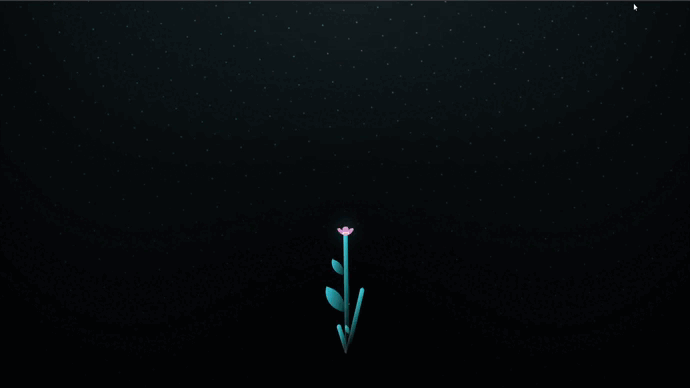

<br />
<p align="center">

<h1 align="center">
    <p style="color:#C03028">Flowers</p>
</h1>



## 🧪 Tecnologias

Esse projeto foi desenvolvido com as seguintes tecnologias:

- [Html](https://developer.mozilla.org/en-US/docs/Web/HTML)
- [Css](https://developer.mozilla.org/pt-BR/docs/Web/CSS)
- [Javascript](https://developer.mozilla.org/en-US/docs/Web/API/Document)

## 🚀 Como executar

Clone o projeto e acesse a pasta do mesmo.

```bash
$ git clone https://github.com/zdog10127/Flowers
$ cd Flowers
```

Para iniciá-lo, siga os passos abaixo:
```bash
# Iniciar o projeto
$ start index.html
```
O app estará disponível no seu browser pelo endereço http://localhost:5500.

## 💻 Projeto

E uma animação de flores. 

## 📝 License

Esse projeto está sob a licença MIT. Veja o arquivo [LICENSE](LICENSE.md) para mais detalhes.
